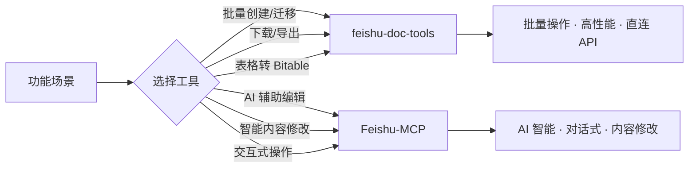
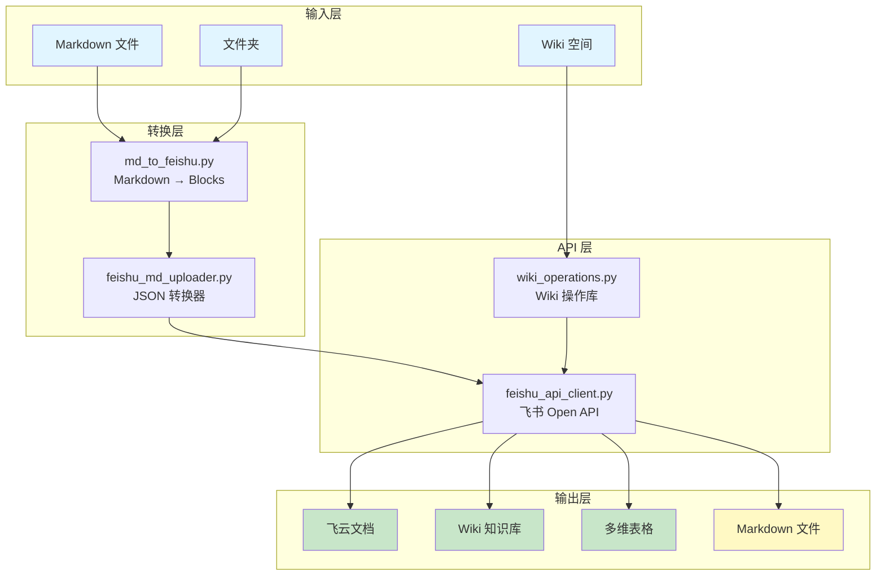
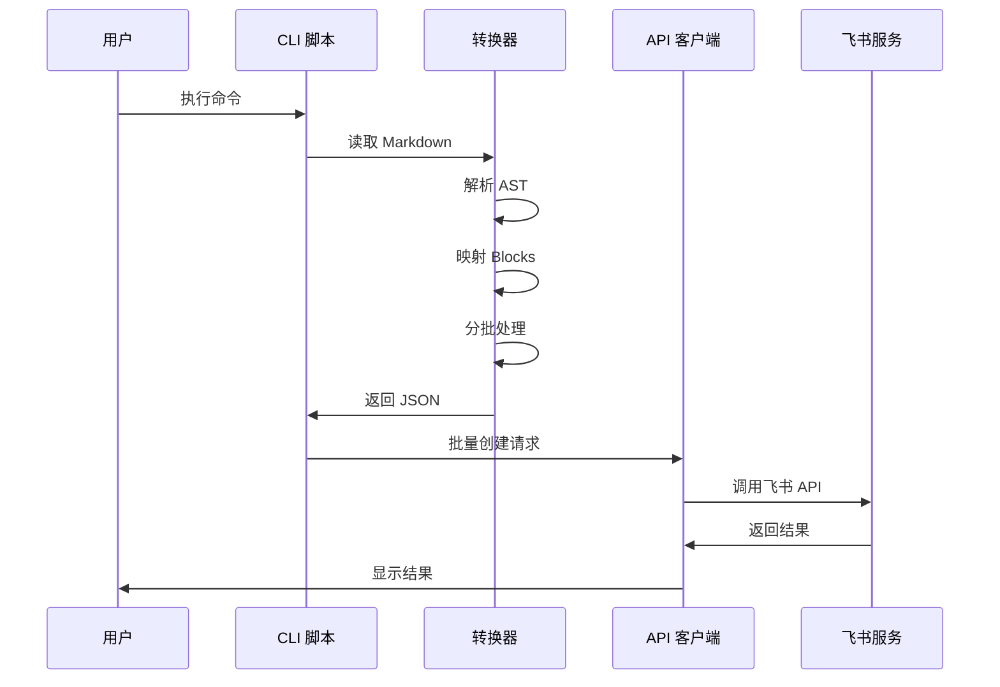

# Feishu Doc Tools

<div align="center">

[](https://github.com/your-repo/feishu-doc-tools)
[](https://www.python.org/downloads/)
[](LICENSE)
[](#)

**飞书文档管理工具套件**

批量创建/迁移 · Wiki 知识库 · 多维表格 · 下载导出

[Quick Start](#-quick-start) • [Documentation](docs/INDEX.md) • [Features](#-核心特性) • [Contributing](#-contributing)

</div>

---

## Table of Contents

- [核心特性](#-核心特性)
- [功能对比](#-功能对比)
- [架构设计](#-架构设计)
- [快速开始](#-quick-start)
- [使用场景](#-使用场景)
- [性能指标](#-性能指标)
- [项目结构](#-项目结构)
- [文档](#-文档)
- [开发](#-开发)
- [相关项目](#-相关项目)

---

## 核心特性

### 上传功能

- **批量创建文档** - 一键上传整个文件夹到飞书
- **批量 Wiki 迁移** - 批量上传到 Wiki 知识库
- **表格转 Bitable** - Markdown 表格自动转为多维表格
- **并行上传** - 大文档性能提升 5-10x
- **个人知识库** - 自动检测并设置权限

### 下载功能 ⭐

- **文档下载/导出** - 下载飞书文档为 Markdown
- **批量下载 Wiki** - 批量下载知识库文档
- **Wiki 结构预览** - 树形显示知识库结构
- **智能路径解析** - 支持按名称/路径/标题查找

### 完整格式支持

| 元素 | 支持状态 | 说明 |
|------|---------|------|
| 标题 (h1-h9) | ✅ | 完整支持 9 级标题 |
| 段落/文本样式 | ✅ | 粗体、斜体、代码、删除线 |
| 代码块 | ✅ | 50+ 语言语法高亮 |
| 列表 | ✅ | 有序/无序列表 |
| 图片 | ✅ | 本地/网络图片 |
| 表格 | ✅ | 飞书表格格式 |
| 数学公式 | ✅ | LaTeX 格式 |
| Mermaid 图表 | ✅ | 白板块 |
| 引用块 | ✅ | 完整支持 |

### 灵活部署

- **零上下文占用** - 不占用 AI 模型 token
- **直连 API 模式** - 快速、低成本
- **CLI 工具集** - 27 个专用脚本
- **Python API** - 便于集成

---

## 功能对比

### feishu-doc-tools vs Feishu-MCP



| 功能场景 | feishu-doc-tools | Feishu-MCP | 推荐 |
|---------|----------------|------------|------|
| **批量创建文档** | ✅ 原生支持 | ⚠️ 需要循环 | feishu-doc-tools |
| **批量上传文件夹** | ✅ 原生支持 | ⚠️ 需要循环 | feishu-doc-tools |
| **文档下载/导出** ⭐ | **✅ 原生支持** | **⚠️ 需手动** | **feishu-doc-tools** |
| **批量下载 Wiki** ⭐ | **✅ 原生支持** | **⚠️ 需循环** | **feishu-doc-tools** |
| **Wiki 结构预览** ⭐ | **✅ 原生支持** | **⚠️ 需循环** | **feishu-doc-tools** |
| **表格转 Bitable** | ✅ 专门工具 | ❌ 不支持 | feishu-doc-tools |
| **大文档上传** | ✅ 并行优化 (5-10x) | ⚠️ 较慢 | feishu-doc-tools |
| **AI 辅助编辑** | ❌ 不支持 | ✅ 核心功能 | Feishu-MCP |
| **智能内容修改** | ❌ 不支持 | ✅ 核心功能 | Feishu-MCP |
| **交互式操作** | ❌ CLI 工具 | ✅ 对话式 | Feishu-MCP |

**使用建议**: 两个工具互补使用

- **创建/迁移/下载**: 使用 feishu-doc-tools（本工具）
- **编辑/维护**: 使用 Feishu-MCP

---

## 架构设计

### 系统架构



### 工作流程



### 核心模块

| 模块 | 功能 | 代码量 | 主要方法 |
|------|------|--------|---------|
| **FeishuApiClient** | 飞书 Open API 客户端 | ~1,800 行 | 27+ 方法，支持文档/Wiki/Bitable/图片操作 |
| **FeishuMdUploader** | Markdown → 飞书转换 | ~400 行 | 支持所有 Markdown 元素转换 |
| **WikiOperations** | Wiki 操作共享库 | ~300 行 | 空间解析、路径解析、节点查找 |

---

## Quick Start

### 环境要求

- Python 3.8.1+
- uv (用于依赖管理)

### 安装

```bash
# 克隆仓库
git clone https://github.com/hoastyle/feishu-doc-tools.git
cd feishu-doc-tools

# 安装依赖
uv sync

# 测试 API 连接
uv run python scripts/test_api_connectivity.py
```

### 配置

```bash
# 复制环境变量模板
cp .env.example .env

# 编辑 .env 文件
export FEISHU_APP_ID="cli_xxxxx"
export FEISHU_APP_SECRET="xxxxx"
```

### 第一个文档

```bash
# 创建单个文档
uv run python scripts/create_feishu_doc.py README.md --title "项目文档"

# 批量上传文件夹
uv run python scripts/batch_create_docs.py ./docs
```

---

## 使用场景

### 场景 1: 上传到云文档

```bash
# 单个文档
uv run python scripts/create_feishu_doc.py README.md --title "项目文档"

# 批量上传
uv run python scripts/batch_create_docs.py ./docs --recursive --parallel

# 大文档快速上传
uv run python scripts/md_to_feishu.py 大文档.md --parallel
```

### 场景 2: 上传到 Wiki 知识库

```bash
# 列出可用空间
uv run python scripts/create_wiki_doc.py --list-spaces

# 上传到指定空间（按名称）
uv run python scripts/create_wiki_doc.py README.md --space-name "产品文档"

# 使用个人知识库（自动检测）
uv run python scripts/create_wiki_doc.py README.md --personal --auto-permission

# 批量上传到 Wiki
uv run python scripts/batch_create_wiki_docs.py ./docs --space-name "产品文档"
```

### 场景 3: 下载文档 ⭐

```bash
# 按名称和路径下载（推荐）
uv run python scripts/download_doc.py \
  --space-name "产品文档" \
  --wiki-path "/API/REST API" \
  -o api.md

# 按文档标题下载
uv run python scripts/download_doc.py \
  --space-name "产品文档" \
  --doc-title "API 参考" \
  -o api.md

# 按文档 ID 下载
uv run python scripts/download_doc.py doxcnxxxxx output.md
```

### 场景 4: 批量下载 Wiki ⭐

```bash
# 下载整个知识库
uv run python scripts/download_wiki.py --space-name "产品文档" ./backup

# 部分下载（从指定路径开始）
uv run python scripts/download_wiki.py \
  --space-name "产品文档" \
  --start-path "/API/参考" \
  ./api_docs

# 下载个人知识库
uv run python scripts/download_wiki.py --personal ./my_backup
```

### 场景 5: 预览 Wiki 结构 ⭐

```bash
# 查看完整层次结构
uv run python scripts/list_wiki_tree.py --space-name "产品文档"

# 限制深度（只看 2 层）
uv run python scripts/list_wiki_tree.py --space-name "产品文档" --max-depth 2

# 从指定路径开始
uv run python scripts/list_wiki_tree.py --space-name "产品文档" --start-path "/API"

# 查看个人知识库
uv run python scripts/list_wiki_tree.py --personal
```

### 场景 6: 表格转多维表格

```bash
# Markdown 表格转 Bitable
uv run python scripts/md_table_to_bitable.py data.md --auto-types --create-app
```

---

## 性能指标

### 文档上传性能

| 文档大小 | 串行耗时 | 并行耗时 | 性能提升 |
|---------|----------|----------|----------|
| 小型 (<50 blocks) | ~3s | ~2s | **1.5x** |
| 中型 (50-200 blocks) | ~30s | ~8s | **3.8x** |
| 大型 (200-1000 blocks) | ~180s | ~30s | **6x** |
| 超大 (1000+ blocks) | ~600s | ~75s | **8x** |

### Wiki 树遍历性能

| Wiki 大小 | 顺序耗时 | 并行（5 workers）| 提升 |
|----------|----------|----------------|------|
| 小型 (<10 节点) | ~1s | ~0.3s | **3x** |
| 中型 (10-50 节点) | ~8s | ~2s | **4x** |
| 大型 (50-100 节点) | ~30s | ~6s | **5x** |
| 超大 (100+ 节点) | ~60s+ | ~10s | **6x+** |

### Wiki 下载性能

| Wiki 大小 | 文档数 | 耗时 | 吞吐量 |
|----------|-------|------|--------|
| 小型 | <10 | ~5s | ~2 docs/s |
| 中型 | 10-50 | ~30s | ~1.5 docs/s |
| 大型 | 50-100 | ~90s | ~1 doc/s |
| 超大 | 100+ | ~3min | ~0.6 docs/s |

---

## 项目结构

```
feishu-doc-tools/
├── scripts/                   # 27 个 CLI 工具 (6,916 行代码)
│   ├── 上传工具 (5 个)
│   │   ├── md_to_feishu.py              # 核心转换脚本
│   │   ├── create_feishu_doc.py         # 创建单个云文档
│   │   ├── batch_create_docs.py         # 批量创建云文档
│   │   ├── create_wiki_doc.py           # 创建单个 Wiki 文档
│   │   └── batch_create_wiki_docs.py    # 批量创建 Wiki 文档
│   │
│   ├── 下载工具 (3 个) ⭐
│   │   ├── download_doc.py              # 下载单个文档
│   │   ├── download_wiki.py             # 批量下载 Wiki
│   │   └── list_wiki_tree.py            # 预览 Wiki 结构
│   │
│   ├── 数据工具 (1 个)
│   │   └── md_table_to_bitable.py       # 表格转 Bitable
│   │
│   ├── 调试工具 (4 个)
│   │   ├── test_api_connectivity.py     # API 连接测试
│   │   ├── get_root_info.py             # 获取工作区信息
│   │   ├── list_folders.py              # 列出文件夹
│   │   └── feishu_to_md.py              # 飞书转 Markdown
│   │
│   └── 认证工具 (14 个)
│       ├── setup_user_auth.py           # 用户认证设置
│       ├── diagnose_auth_flow.py        # 认证流诊断
│       ├── diagnose_oauth.py            # OAuth 诊断
│       └── ... (更多认证工具)
│
├── lib/                        # 核心库模块 (2,462 行代码)
│   ├── feishu_api_client.py    # 直连 API 客户端
│   ├── feishu_md_uploader.py   # 飞书转换工具
│   └── wiki_operations.py      # Wiki 操作共享库
│
├── tests/                      # 测试套件 (4,130 行代码)
│   ├── test_md_to_feishu.py            # 转换测试
│   ├── test_feishu_api_extended.py    # API 测试
│   ├── test_table_to_bitable.py       # Bitable 测试
│   ├── test_performance.py            # 性能测试
│   └── ... (更多测试)
│
├── docs/                       # 完整文档
│   ├── INDEX.md                      # 文档中心
│   ├── user/                        # 用户文档 (7 个)
│   ├── guides/                      # 专题指南 (2 个)
│   ├── design/                      # 设计文档 (5 个)
│   ├── technical/                   # 技术文档 (1 个)
│   └── archive/                     # 归档文档 (3 个)
│
├── pyproject.toml               # uv 项目配置和依赖清单
├── uv.lock                      # 依赖锁定文件（确保环境一致）
└── README.md                    # 本文件
```

### 代码统计

| 目录 | 文件数 | 代码行数 |
|------|-------|---------|
| scripts/ | 27 | 6,916 |
| lib/ | 4 | 2,462 |
| tests/ | 9 | 4,130 |
| **总计** | **40** | **13,508** |

---

## 文档

### 用户文档

| 文档 | 说明 | 阅读时间 |
|------|------|---------|
| [QUICK_START.md](docs/user/QUICK_START.md) | 10 分钟快速上手指南 | 10 分钟 |
| [DOWNLOAD_GUIDE.md](docs/user/DOWNLOAD_GUIDE.md) ⭐ | 下载功能完整指南 | 15 分钟 |
| [USER_AUTH_GUIDE.md](docs/user/USER_AUTH_GUIDE.md) | 用户认证使用指南 | 12 分钟 |
| [BATCH_OPERATIONS.md](docs/user/BATCH_OPERATIONS.md) | 批量操作指南 | 15 分钟 |
| [BITABLE_OPERATIONS.md](docs/user/BITABLE_OPERATIONS.md) | 多维表格操作 | 10 分钟 |
| [API_OPERATIONS.md](docs/user/API_OPERATIONS.md) | API 完整参考 | 20 分钟 |
| [TROUBLESHOOTING.md](docs/user/TROUBLESHOOTING.md) | 故障排除指南 | 10 分钟 |

### 专题指南

| 文档 | 说明 | 目标读者 |
|------|------|---------|
| [DOWNLOAD_REFERENCE.md](docs/guides/DOWNLOAD_REFERENCE.md) | 下载功能技术参考 | 开发者和技术用户 |
| [LIST_WIKI_TREE_GUIDE.md](docs/guides/LIST_WIKI_TREE_GUIDE.md) | Wiki 结构预览工具详解 | 所有用户 |

### 设计文档

| 文档 | 说明 | 重点 |
|------|------|------|
| [DESIGN.md](docs/design/DESIGN.md) | 系统架构设计 | 整体设计思路 |
| [DIRECT_API_MODE.md](docs/design/DIRECT_API_MODE.md) | 直连 API 模式 | 无 AI 的直接调用 |
| [FEISHU_MCP_INTEGRATION.md](docs/design/FEISHU_MCP_INTEGRATION.md) | MCP 服务器集成 | Feishu-MCP 使用 |
| [UNIFIED_WIKI_PATH_SEMANTICS.md](docs/design/UNIFIED_WIKI_PATH_SEMANTICS.md) | 参数语义统一指南 | 从 v0.2.0 迁移 |
| [FEATURE_GAPS.md](docs/design/FEATURE_GAPS.md) | 功能限制说明 | 已知限制和 workaround |

### 文档中心

- [docs/INDEX.md](docs/INDEX.md) - 文档导航索引

---

## 开发

### 测试

```bash
# 运行所有测试
uv run pytest tests/

# 运行特定测试
uv run pytest tests/test_md_to_feishu.py -v

# 测试覆盖率
uv run pytest --cov=scripts --cov=lib --cov-report=term-missing tests/

# 性能测试
uv run pytest tests/test_performance.py -v
```

### 测试覆盖

| 测试文件 | 覆盖范围 | 测试用例数 |
|---------|---------|-----------|
| test_md_to_feishu.py | Markdown 转换 | 15+ |
| test_feishu_api_extended.py | API 客户端 | 12+ |
| test_table_to_bitable.py | Bitable 操作 | 10+ |
| test_performance.py | 性能基准 | 8+ |
| test_recursive_search.py | 递归搜索 | 5+ |
| test_user_auth.py | 用户认证 | 6+ |
| test_oauth_url.py | OAuth URL | 4+ |
| test_scope_permissions.py | 权限范围 | 3+ |

### 贡献

欢迎提交 Issue 和 Pull Request！

1. Fork 项目
2. 创建特性分支 (`git checkout -b feature/AmazingFeature`)
3. 提交更改 (`git commit -m 'feat: Add amazing feature'`)
4. 推送到分支 (`git push origin feature/AmazingFeature`)
5. 创建 Pull Request

### 开发规范

- 遵循现有代码风格
- 添加测试覆盖新功能
- 更新相关文档
- 确保所有测试通过

---

## 相关项目

### 互补工具

- **[Feishu-MCP](https://github.com/hoastyle/Feishu-MCP)** - 飞书 MCP 服务器
  - 用于 AI 辅助编辑、智能修改
  - 与本工具互补使用

### 依赖库

- **[markdown-it-py](https://github.com/executablebooks/markdown-it-py)** - Python Markdown 解析器
- **[requests](https://github.com/psf/requests)** - HTTP 客户端
- **[mdit-py-plugins](https://github.com/executablebooks/mdit-py-plugins)** - Markdown 插件集合

---

## 版本历史

### v0.2.1 (2026-01-19)

- 新增文档下载功能
- 新增批量 Wiki 下载功能
- 新增 Wiki 结构预览工具
- OAuth 认证迁移完成
- 项目结构重组

### v0.2.0 (2025-01-18)

- 批量 Wiki 上传功能
- 个人知识库自动检测
- 用户权限自动设置
- 并行上传性能优化

### v0.1.0 (2024-12-01)

- 初始版本
- 基础文档上传功能
- Wiki 知识库支持

---

## 许可证

MIT License - 详见 [LICENSE](LICENSE)

---

## 获取帮助

- 📚 [文档中心](docs/INDEX.md)
- 🚀 [快速开始](docs/user/QUICK_START.md)
- 🐛 [故障排除](docs/user/TROUBLESHOOTING.md)
- 💬 提交 [Issue](https://github.com/hoastyle/feishu-doc-tools/issues)

---

<div align="center">

**Made with ❤️ by the feishu-doc-tools team**

[⬆ Back to Top](#feishu-doc-tools)

</div>
