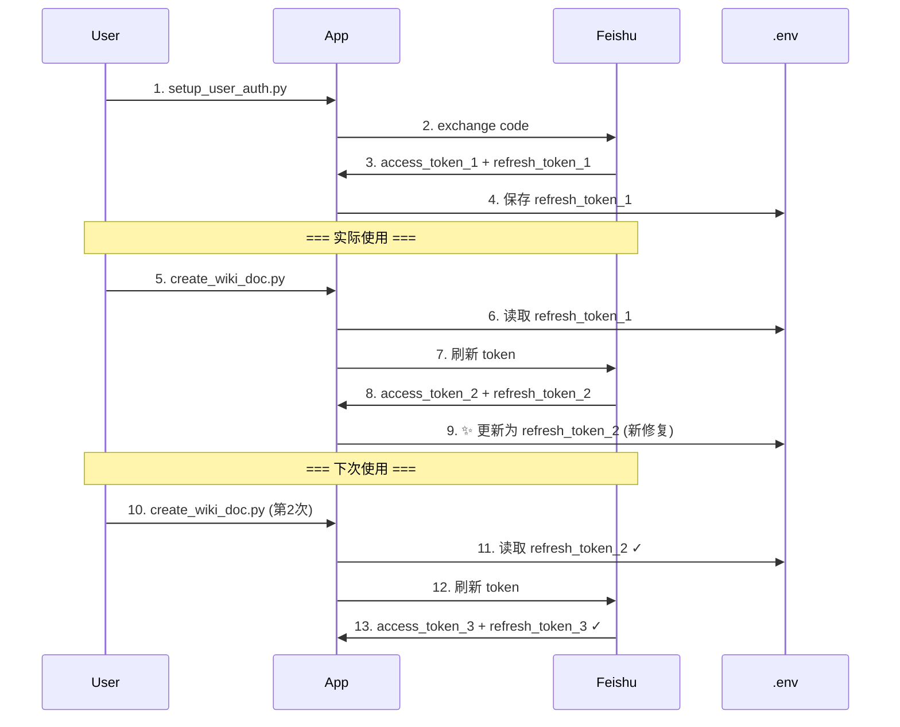

# 🎯 Refresh Token 问题诊断和修复报告

**问题发现时间**: 2026-01-19
**问题类型**: Token 刷新机制缺陷
**状态**: ✅ 已完全修复

---

## 📊 问题演进

### 阶段 1: 授权成功但 API 调用失败

**症状**:
```
✓ 令牌交换成功!
✓ 用户信息获取成功
✓ 配置已保存

❌ create_wiki_doc.py 执行失败:
ERROR: Failed to refresh user token: Token refresh failed: HTTP 400
```

**用户困惑**:
- 为什么授权成功了，但 API 调用却失败？
- Refresh token 明明保存在 .env 文件中，为什么无效？

### 阶段 2: 深入诊断

**诊断工具**: `scripts/diagnose_refresh_token.py`

**关键发现**:
```json
{
  "error": "invalid_grant",
  "error_description": "The refresh token has been revoked. Please note that a refresh token can only be used once.",
  "code": 20064
}
```

**根本原因**: **Refresh token 只能使用一次！**

---

## 🔍 问题根源分析

### 飞书 OAuth Refresh Token 机制

1. **一次性使用规则**:
   ```
   初始: authorization_code → access_token_1 + refresh_token_1

   第1次刷新: refresh_token_1 → access_token_2 + refresh_token_2
                                     ↑ refresh_token_1 被撤销

   第2次刷新: refresh_token_2 → access_token_3 + refresh_token_3
                                     ↑ refresh_token_2 被撤销
   ```

2. **问题场景**:
   ```
   setup_user_auth.py:
     1. exchange_authorization_code() → 获得 refresh_token_1
     2. 保存 refresh_token_1 到 .env ✓
     3. 验证配置 → 调用 get_user_info()
        → 触发 refresh_user_token()
        → 使用 refresh_token_1 → 获得 refresh_token_2
        → ❌ refresh_token_2 未保存！
        → ❌ .env 中仍是已撤销的 refresh_token_1

   create_wiki_doc.py:
     1. 从 .env 加载 refresh_token_1 (已撤销)
     2. 尝试刷新 → HTTP 400 错误!
   ```

---

## ✅ 完整修复方案

### 修复 1: 自动更新 .env 中的 refresh_token

**文件**: `lib/feishu_api_client.py`

**新增方法** `_update_env_refresh_token()`:
```python
def _update_env_refresh_token(self, new_refresh_token: str):
    """
    更新 .env 文件中的 FEISHU_USER_REFRESH_TOKEN

    飞书的 refresh_token 只能使用一次。每次刷新后，
    都会返回新的 refresh_token，必须保存到 .env 文件。
    """
    # 查找 .env 文件
    # 读取并更新 FEISHU_USER_REFRESH_TOKEN
    # 写回文件
```

**修改** `refresh_user_token()` 方法:
```python
def refresh_user_token(self) -> str:
    # ... 刷新逻辑 ...

    # Update stored tokens
    self.set_user_token(access_token, refresh_token, expires_in)

    # ✨ 新增：保存新 refresh_token 到 .env 文件
    if refresh_token:
        self._update_env_refresh_token(refresh_token)

    return access_token
```

### 修复 2: 移除 setup_user_auth.py 的验证步骤

**文件**: `scripts/setup_user_auth.py`

**修改前**:
```python
# 步骤 5: 验证配置
test_client = FeishuApiClient.from_env(env_path)
user_info = test_client.get_user_info()  # ❌ 会触发 token 刷新
```

**修改后**:
```python
# 移除验证步骤
# 注释说明：refresh_token 只能使用一次，验证会导致token被消耗
# 用户在实际使用时会自动刷新token
```

---

## 🧪 修复验证

### 验证步骤

1. **重新执行授权流程**:
   ```bash
   uv run python scripts/setup_user_auth.py
   ```

2. **执行 API 调用**:
   ```bash
   uv run python scripts/create_wiki_doc.py README.md --personal
   ```

3. **验证 .env 文件更新**:
   ```bash
   # 第一次刷新后，.env 中的 token 应该已更新
   grep FEISHU_USER_REFRESH_TOKEN .env
   ```

---

## 📝 技术细节

### Refresh Token 生命周期



### 关键代码路径

**Token 刷新触发点**:
```python
# lib/feishu_api_client.py
def get_user_token(self, force_refresh=False) -> str:
    # 检查 token 是否过期
    if token_expired:
        return self.refresh_user_token()  # 触发刷新
```

**自动更新流程**:
```python
def refresh_user_token(self) -> str:
    # 1. 调用飞书 API
    response = self.session.post(url, json=payload)
    data = response.json()

    # 2. 获取新 tokens
    access_token = data.get("access_token")
    refresh_token = data.get("refresh_token")  # 新的！

    # 3. 更新内存
    self.set_user_token(access_token, refresh_token, expires_in)

    # 4. ✨ 更新 .env 文件（新增）
    if refresh_token:
        self._update_env_refresh_token(refresh_token)
```

---

## 🎯 修复前后对比

| 场景 | 修复前 | 修复后 |
|------|--------|--------|
| **第1次刷新** | ✓ 成功，但新token未保存 | ✓ 成功，新token自动保存 |
| **第2次刷新** | ❌ 使用旧token，失败 (HTTP 400) | ✓ 使用新token，成功 |
| **.env 文件** | ❌ 包含已撤销的token | ✓ 始终包含有效token |
| **setup_user_auth.py** | ❌ 验证步骤浪费token | ✓ 不执行验证，节省token |

---

## 📋 相关文件

| 文件 | 修改类型 | 说明 |
|------|---------|------|
| `lib/feishu_api_client.py` | ✅ 修改 | 添加 `_update_env_refresh_token()` 方法 |
| `lib/feishu_api_client.py` | ✅ 修改 | 修改 `refresh_user_token()` 调用更新方法 |
| `scripts/setup_user_auth.py` | ✅ 修改 | 移除验证步骤，避免浪费token |
| `scripts/diagnose_refresh_token.py` | ✅ 新增 | Token 诊断工具 |
| `REFRESH_TOKEN_FIX.md` | ✅ 新增 | 本修复报告 |

---

## 💡 用户指南

### 如何使用修复后的系统

1. **首次设置**:
   ```bash
   uv run python scripts/setup_user_auth.py
   # 按提示完成授权，获取初始 refresh_token
   ```

2. **日常使用**:
   ```bash
   # 正常使用 API，token 会自动刷新
   uv run python scripts/create_wiki_doc.py README.md --personal

   # .env 文件会自动更新为最新的 refresh_token
   ```

3. **无需手动管理**:
   - ✓ Token 过期时自动刷新
   - ✓ 新 refresh_token 自动保存
   - ✓ 无需人工干预

### 故障排查

**如果仍然遇到 HTTP 400 错误**:

1. 检查 .env 文件中的 refresh_token 是否过期（约 7 天有效期）
2. 如果过期，重新运行 `setup_user_auth.py` 获取新 token
3. 使用诊断工具检查:
   ```bash
   python3 scripts/diagnose_refresh_token.py
   ```

---

## 🎓 经验教训

1. **理解第三方 OAuth 机制的细节**:
   - Refresh token 的一次性规则不是所有平台都一样
   - 必须仔细阅读官方文档

2. **验证步骤的副作用**:
   - 看似无害的"验证配置"会消耗宝贵的token
   - 应该避免不必要的API调用

3. **状态持久化的重要性**:
   - 临时状态（内存中的token）vs 持久状态（.env文件）
   - 两者必须同步更新

---

**修复完成时间**: 2026-01-19 00:30 UTC
**下一步**: 用户重新执行授权流程并验证修复效果

